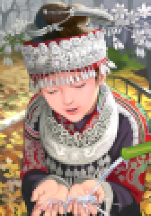
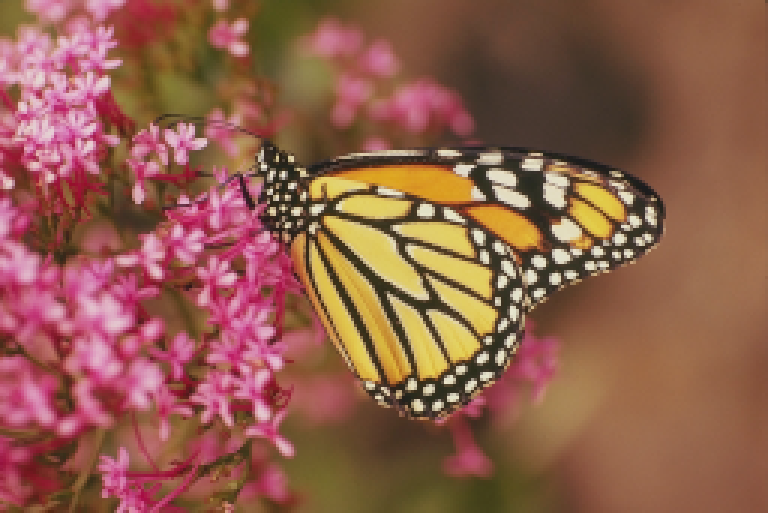
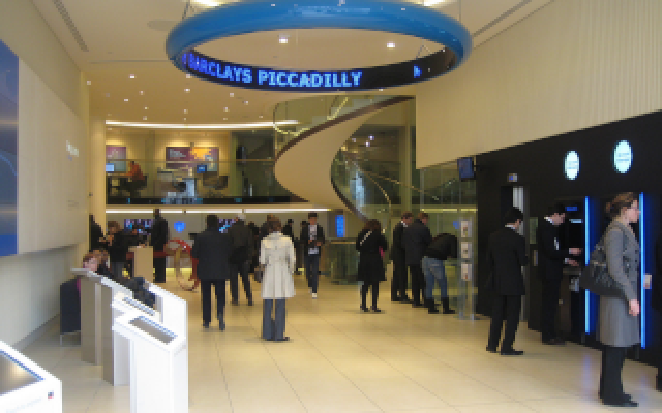

# Rusty_SR

Deep learning super resolution written in rust.
Use baked in neural networks to upscale your images, or train your own specialised neural network!

For best performance compile using environmental variable `RUSTFLAGS="-C target-cpu=native" ` and release mode `cargo build --release`
or: `cargo rustc --release -- -C target-cpu=native`

Feel free to open an issue to raise any problems or for general discussion.

## Examples
Set14 Cartoon

Set14 Butterfly

Bank Lobby (test image for [Neural Enhance](https://github.com/alexjc/neural-enhance))
CC-BY-SA @benarent

## Note
Attemping to upscale images with significant noise or jpeg artifacts is likely to produce poor results. Input and output colorspace are nominally sRGB.

## License
MIT
